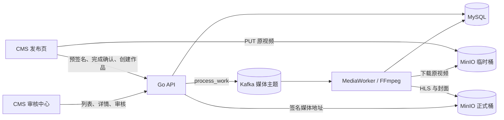
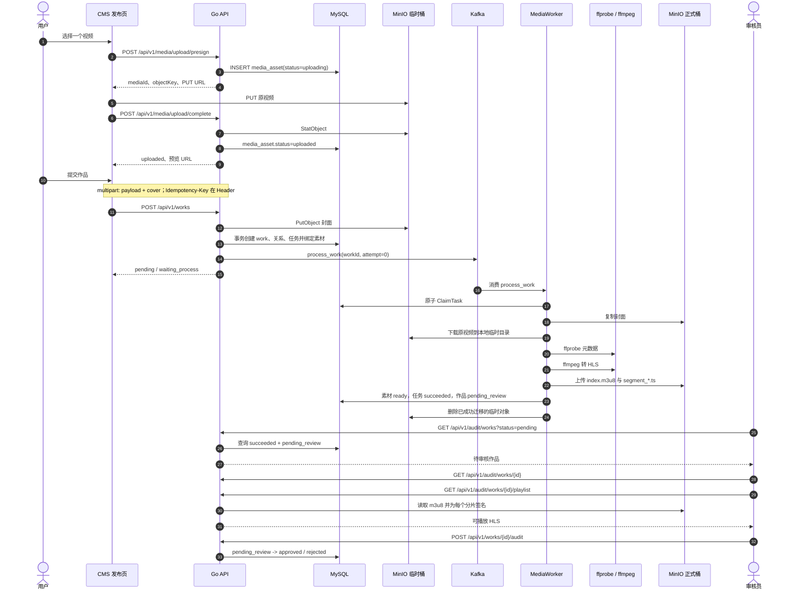
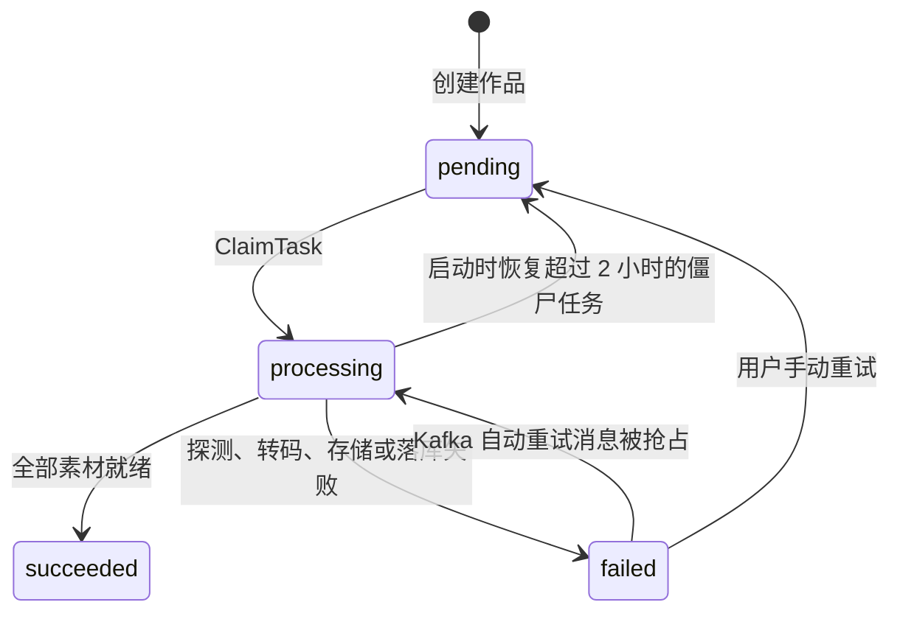
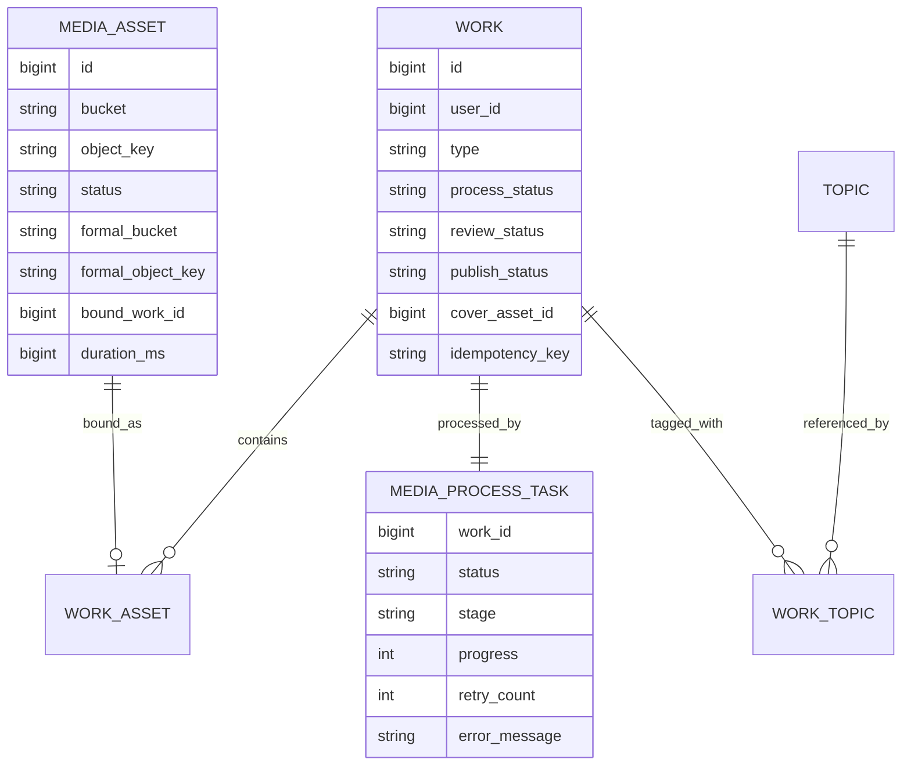

# 视频上传、转码到审核台的完整流程

> 文档基于当前仓库代码整理，最后核对日期：2026-08-11。范围是 CMS 发布视频后，素材从临时对象存储进入后台转码，再进入审核中心并可被审核的完整链路。

## 1. 结论摘要

当前实现采用“客户端直传 MinIO + MySQL 持久化状态 + Kafka 异步通知 + API 进程内 MediaWorker 转码”的方案：

1. CMS 请求上传预签名 URL，后端先创建状态为 `uploading` 的 `media_asset`。
2. 浏览器使用预签名 URL 将原视频直接 PUT 到 MinIO 临时桶，视频数据不经过 Go API。
3. CMS 调用上传完成接口；后端通过 MinIO `StatObject` 确认对象存在，将素材改为 `uploaded`。
4. 用户提交作品时，封面通过 multipart 上传给 Go API，视频则只提交 `mediaId`。后端在同一个数据库事务中创建 `work`、`work_asset`、`media_process_task`，并把素材绑定到作品。
5. 事务提交后，后端同步向 Kafka 投递 `process_work` 消息。Kafka 投递失败不会回滚作品，但接口会返回失败，后台补偿扫描或相同幂等键重试可再次投递。
6. MediaWorker 消费消息并原子抢占任务；先迁移封面，再下载原视频，使用 `ffprobe` 探测，使用 `ffmpeg` 转为单码率 HLS，上传到正式桶。
7. 全部素材就绪后，数据库事务把作品改为 `process_status=succeeded`、`review_status=pending_review`。这是作品进入审核台的唯一硬门槛。
8. 审核台只查询媒体处理成功的作品。审核员查看详情时，后端返回封面短期签名 URL，并动态生成带签名分片地址的 HLS 播放列表。

主流程涉及的基础设施如下：



代码入口：

- 上传预签名：[createUploadPresignLogic.go](../api/internal/logic/media/createUploadPresignLogic.go)
- 上传完成：[completeUploadLogic.go](../api/internal/logic/media/completeUploadLogic.go)
- 创建作品：[createWorkLogic.go](../api/internal/logic/media/createWorkLogic.go)
- Kafka 消息：[mediaQueue.go](../api/internal/queue/mediaQueue.go)
- 转码 Worker：[mediaWorker.go](../api/internal/worker/mediaWorker.go)
- 状态落库：[media_repo/repo.go](../api/internal/repo/media_repo/repo.go)
- 审核查询与提交：[work_repo/repo.go](../api/internal/repo/work_repo/repo.go)

## 2. 完整时序



## 3. 阶段一：获取预签名并直传原视频

### 3.1 创建上传记录

CMS 对每个文件调用：

```http
POST /api/v1/media/upload/presign
Authorization: Bearer <token>
Content-Type: application/json

{
  "resourceType": "Video",
  "fileName": "demo.mp4",
  "contentType": "video/mp4"
}
```

后端执行以下检查和写入：

- 必须是登录用户。
- `resourceType` 只能是 `image` 或 `video`。
- 文件名必须带扩展名；视频扩展名必须在后端白名单中。
- `.ts` 按 MPEG-TS 视频处理；即使浏览器未返回 MIME，CMS 也会按扩展名识别，并把上传 Content-Type 统一为 `video/mp2t`。
- 确保临时桶存在。
- 对象键格式为 `<userId>/<yyyyMMdd>/<uuid>-<安全文件名>`。
- 创建 `media_asset`，初始状态为 `uploading`。
- 返回 PUT 预签名 URL、对象键和短期 GET 预览 URL。有效期由 `Minio.PresignExpire` 控制，未配置时为 900 秒。

CMS 随后直接 PUT 到 MinIO。该请求绕过 Go API，因此 API 的 HTTP 请求体上限不限制原视频大小。

CMS 对 MP4/MOV 等浏览器原生支持的格式直接使用 `<video>`；对 MPEG-TS 使用 `mpegts.js` 解封装到 MediaSource，因此可以预览常见的 H.264/AAC TS，并从当前播放时间绘制 Canvas 生成 JPEG 封面。TS 内部编码仍需浏览器 MediaSource 支持；后端 FFmpeg 转码的编码兼容范围通常更广。

前端调用位置：[PublishView.vue](../../front/cms/src/views/publish/PublishView.vue) 与 [media.js](../../front/cms/src/api/media.js)。后端实现见 [createUploadPresignLogic.go](../api/internal/logic/media/createUploadPresignLogic.go)。

### 3.2 上传完成确认

浏览器 PUT 成功后调用：

```http
POST /api/v1/media/upload/complete
Authorization: Bearer <token>
Content-Type: application/json

{
  "mediaId": 123,
  "objectKey": "42/20260811/...-demo.mp4"
}
```

后端校验素材归属用户、请求对象键与数据库一致，并通过 `StatObject` 确认对象存在；随后记录对象大小和 MinIO 返回的 Content-Type，将状态改为 `uploaded`。

这个接口只证明“指定对象已经存在”，不会在此时调用 `ffprobe`，也不会嗅探真实文件类型。真正的视频有效性要到 Worker 探测阶段才确定。

## 4. 阶段二：创建作品并投递处理任务

### 4.1 请求组成

CMS 使用 `multipart/form-data` 调用 `POST /api/v1/works`：

- `payload`：作品 JSON，包括类型、标题、可见性、视频 `mediaId`、话题和定时发布时间等。
- `cover`：封面 JPEG/PNG。视频封面由 CMS 从视频帧截取后上传。
- `Idempotency-Key`：发布幂等键，优先级高于 payload 内的同名字段。

视频作品必须且只能绑定一个视频素材；封面必须存在，最大 100 MB，且能被 Go 图片解码器识别为 JPEG 或 PNG。

### 4.2 数据库事务

[work_repo/repo.go](../api/internal/repo/work_repo/repo.go) 在一个 MySQL 事务中完成：

1. 加行锁读取视频素材并校验：属于当前用户、状态为 `uploaded`、未绑定其他作品、素材类型与作品类型一致。
2. 创建 `work`：
   - `process_status=pending`
   - `review_status=waiting_process`
   - `publish_status=pending`
3. 创建视频和封面的 `work_asset` 关系。
4. 把相关 `media_asset` 更新为 `bound`，写入 `bound_work_id`。
5. 写入话题关系。
6. 创建 `media_process_task`：`status=pending`、`stage=queued`、`progress=0`。

数据库迁移通过 `(user_id, idempotency_key)` 唯一索引保证用户维度幂等。重复请求会返回已有作品；如果已有作品仍是 `pending`，逻辑会再次尝试投递 Kafka 消息。

### 4.3 数据库与 Kafka 的一致性

Kafka 消息是在数据库事务提交后发送的：

```json
{"type":"process_work","workId":456,"attempt":0}
```

消息以 `workId` 字符串作为 Kafka key，并使用同步发送。当前没有事务消息或 Outbox，因此存在“数据库已经提交、Kafka 投递失败”的时间窗。实现用两种方式补偿：

- 用户以相同 `Idempotency-Key` 重试创建作品时，后端发现已有 `pending` 作品并重新投递。
- Worker 内的 dispatcher 每 30 秒扫描一次更新时间早于 20 秒的 `pending` 任务，每批最多补投 100 个。

所以创建作品接口返回 Kafka 错误时，不能直接认为数据库中没有作品；应使用相同幂等键重试，或者查询作品状态。

### 4.4 当前前端如何衔接异步处理

创建作品接口成功后，发布页立即删除本地草稿并展示“后台将自动处理素材并进入审核”，但不会轮询 `GET /api/v1/works/{workId}/status`。虽然前端 API 层已经定义 `getWorkStatus`，当前页面没有调用它。

审核中心也没有 WebSocket、SSE 或定时轮询；它在页面挂载、切换标签、搜索、翻页、手动重新加载或提交审核后重新请求列表。因此，“Worker 已完成”不会主动推送到已打开的审核页面，审核员需要触发刷新才能看到刚进入队列的作品。

## 5. 阶段三：Worker 抢占、探测与 HLS 转码

### 5.1 Worker 的运行方式

MediaWorker 不是独立服务，而是和 HTTP API 在同一个 Go 进程、同一个 `serviceGroup` 中启动，见 [gulu.go](../api/gulu.go)。每个 API 实例都会同时启动：

- Kafka 媒体消费者；
- pending 任务补偿扫描器；
- 定时发布扫描器。

Kafka consumer group 用于分摊消息；数据库 `ClaimTask` 则是最后一道并发保护。`ClaimTask` 只允许 `pending` 或 `failed` 任务原子更新为 `processing`，抢占失败的重复消息直接按成功消费处理。

### 5.2 实际处理步骤

视频作品正常有两个素材：封面和视频。查询顺序把封面排在视频前面。

1. 任务更新为 `processing/preparing`，作品更新为 `processing/waiting_process`。
2. 封面通过 MinIO 服务端 CopyObject 复制到：
   `works/<workId>/cover/<assetId>.<ext>`。
3. 原视频从临时桶下载到 `MediaWorker.TempDir` 下的独立临时目录。
4. `ffprobe` 输出 JSON，Worker 提取：
   - 第一条视频轨的宽高；
   - 容器时长并换算为毫秒；
   - 没有有效视频轨则失败。
5. `ffmpeg` 使用固定参数转码：
   - `.ts` 输入额外使用 `+genpts` 生成连续时间戳，并将负时间戳归零；
   - 显式选择第一条视频轨和可选的第一条音频轨，无音频 TS 也可处理；
   - 视频：H.264 (`libx264`)、`preset=medium`、`crf=23`；
   - 音频：AAC 128 kbps；
   - HLS VOD；
   - 分片时长由 `MediaWorker.HlsTime` 控制，默认 6 秒；
   - 输出 `index.m3u8` 和 `segment_%05d.ts`。
6. 遍历输出目录，将 HLS 文件上传到正式桶：
   `works/<workId>/video/hls/`。
7. 视频 `media_asset` 改为 `ready`，`formal_object_key` 指向 `index.m3u8`，并写入时长、宽、高。
8. 删除临时桶中的原视频；本地临时目录通过 defer 清理。
9. 在同一个数据库事务内完成任务和作品状态：
   - `media_process_task=succeeded/waiting_review/100`
   - `work.process_status=succeeded`
   - `work.review_status=pending_review`
   - `work.publish_status=pending`

当前产物是单码率 HLS，不是多清晰度自适应码率（ABR）清单；代码也没有显式缩放、码率上限、帧率、profile/level 或字幕处理。

## 6. 三套状态机

### 6.1 素材状态 `media_asset.status`

| 状态 | 当前代码中的含义 |
| --- | --- |
| `uploading` | 已创建上传记录，等待浏览器 PUT |
| `uploaded` | MinIO 已存在原始对象，可用于创建作品 |
| `bound` | 已绑定作品，不能再绑定其他作品 |
| `ready` | 正式桶对象已就绪；视频对象键指向 HLS 主清单 |
| `failed` | 所属处理任务失败，且该素材尚未 ready |

迁移 SQL 注释还列出了 `processing`、`expired`，但当前视频主链路没有写入这两个状态的代码。

### 6.2 处理任务状态 `media_process_task`



常见 `stage`：`queued`、`preparing`、`processing_cover`、`processing_video`、`waiting_review`、`failed`。进度是阶段性估算，不是 FFmpeg 的实时转码百分比。

### 6.3 作品状态 `work`

三个字段需要组合理解：

| 阶段 | `process_status` | `review_status` | `publish_status` |
| --- | --- | --- | --- |
| 刚创建 | `pending` | `waiting_process` | `pending` |
| Worker 已抢占 | `processing` | `waiting_process` | `pending` |
| 处理失败 | `failed` | `waiting_process` | `pending` |
| 转码完成、进入审核台 | `succeeded` | `pending_review` | `pending` |
| 审核拒绝 | `succeeded` | `rejected` | `pending` |
| 审核通过、立即发布 | `succeeded` | `approved` | `published` |
| 审核通过、定时发布 | `succeeded` | `approved` | `scheduled` |
| 到达定时时间 | `succeeded` | `approved` | `published` |

创作者可通过 `GET /api/v1/works/{workId}/status` 查看三套状态、任务阶段、进度和失败原因。

## 7. 失败、重试与幂等

### 7.1 Kafka 自动重试

`Consume` 处理失败后先把数据库任务和作品标记为失败，再在 `attempt < MaxRetry` 时发布一条 `attempt+1` 的新消息。默认 `MaxRetry=3` 时，消息 attempt 为 0、1、2、3，即首次执行加最多 3 次自动重试。

如果重试消息发布失败，consumer 返回错误；在 `ForceCommit=false` 下当前 offset 不提交，Kafka 会重新投递原消息。如果已经达到最大次数，失败消息被正常提交，作品保持 `failed`，等待人工重试。

### 7.2 手动重试

作品作者可调用：

```http
POST /api/v1/works/{workId}/retry
Authorization: Bearer <token>
```

后端只允许作者重试 `process_status=failed` 的作品，把作品和任务恢复到 pending，并增加数据库 `retry_count`，随后投递 attempt=1 的消息。若投递失败，pending dispatcher 仍可补投。

### 7.3 进程异常恢复

Worker 启动时会把更新时间早于两小时、仍为 `processing` 的任务恢复为 `pending/queued`。这是防止进程在抢占后宕机造成永久卡死的兜底。

该恢复只更新任务表，没有同步把 `work.process_status` 改回 pending；后续 dispatcher 仍会找到任务，重新抢占时再把作品改为 processing。

### 7.4 中间产物的幂等性

- 正式对象键由 workId/assetId 决定，重试会覆盖同一路径，不会不断生成新版本。
- 已经为 `ready` 且有正式对象键的素材会被跳过，因此封面成功、视频失败时不会重复迁移封面。
- 如果 HLS 上传成功但数据库更新失败，重试会覆盖同名 HLS 文件。
- 如果素材都已 ready，但最终 `CompleteProcessing` 事务失败，任务会被标记失败；下次重试跳过素材处理并重新完成收尾事务。

## 8. 阶段四：进入审核台与视频预览

### 8.1 进入审核台的条件

审核列表的基础条件是：

```sql
w.process_status = 'succeeded'
AND w.deleted_at IS NULL
```

默认“待审核”标签再增加：

```sql
w.review_status = 'pending_review'
```

因此仅 Kafka 消费成功、视频转码成功或 HLS 已上传还不够；必须执行 `CompleteProcessing` 并成功提交数据库事务，作品才会出现在待审核列表。

列表接口是 `GET /api/v1/audit/works`，支持 `status`、`type`、`keyword` 和分页。待审核作品排在已处理作品前，同一类别按作品创建时间升序排列，表现为先提交先审核。

### 8.2 权限

所有相关 API 都先经过 JWT；审核列表、详情、播放列表和审核提交还会检查当前用户 ID 是否在 `Audit.AdminUserIds` 中。当前是配置文件静态白名单，不是数据库 RBAC。

### 8.3 审核详情和 HLS 播放

审核详情只返回状态为 `ready` 的素材。封面和图片使用 30 分钟 MinIO GET 预签名 URL。

视频详情给前端的是后端播放列表路由：

```text
/api/v1/audit/works/<workId>/playlist
```

后端从正式桶读取 `index.m3u8`，保留 `#EXT...` 行，把每条媒体分片路径替换为 30 分钟有效的 MinIO 签名 URL，再以 HLS Content-Type 返回。响应本身设置 `Cache-Control: private, max-age=60`。具体实现见 [hlsPlaylist.go](../api/internal/logic/media/hlsPlaylist.go) 和 [getauditworkplaylistlogic.go](../api/internal/logic/media/getauditworkplaylistlogic.go)。

### 8.4 审核提交后的状态

```http
POST /api/v1/works/{workId}/audit
Authorization: Bearer <admin-token>
Content-Type: application/json

{"decision":"approve","reason":""}
```

或者：

```json
{"decision":"reject","reason":"不符合内容规范"}
```

规则如下：

- 只有 `succeeded + pending_review` 可以审核。
- 拒绝必须填写原因，结果为 `rejected + pending`。
- 通过且定时时间仍在未来，结果为 `approved + scheduled`。
- 其他通过场景立即变为 `approved + published` 并记录 `published_at`。
- 更新 SQL 限制旧状态必须仍是 `pending_review`，两个审核员并发提交时只有一个成功，另一个收到“已被其他审核员处理”。
- 定时发布扫描器每 10 秒将到期的 `scheduled` 作品更新为 `published`。

## 9. 关键表及关系



完整建表基线见 [001_publish_work.sql](../api/internal/models/migrations/001_publish_work.sql)。关键唯一约束包括：

- `work(user_id, idempotency_key)`：发布幂等。
- `work_asset(media_asset_id)`：一个素材只能属于一个作品。
- `media_process_task(work_id, task_type)`：一个作品只有一个同类型媒体任务。

## 10. 接口清单

| 阶段 | 方法与路径 | 主要作用 |
| --- | --- | --- |
| 上传 | `POST /api/v1/media/upload/presign` | 创建 uploading 素材并返回直传 URL |
| 上传 | `PUT <MinIO presigned URL>` | 浏览器直传原视频 |
| 上传 | `POST /api/v1/media/upload/complete` | 确认对象存在并改为 uploaded |
| 发布 | `POST /api/v1/works` | 创建作品、任务并投递 Kafka |
| 状态 | `GET /api/v1/works/{workId}/status` | 作者查询处理、审核、发布状态 |
| 重试 | `POST /api/v1/works/{workId}/retry` | 作者重试失败任务 |
| 审核 | `GET /api/v1/audit/works` | 审核队列列表 |
| 审核 | `GET /api/v1/audit/works/{workId}` | 审核详情和 ready 素材 |
| 审核 | `GET /api/v1/audit/works/{workId}/playlist` | 动态签名 HLS 播放列表 |
| 审核 | `POST /api/v1/works/{workId}/audit` | 通过或拒绝作品 |

接口定义见 [media.api](../api/desc/media/media.api) 和 [publish.api](../api/desc/publish/publish.api)。

## 11. 配置和运行依赖

| 配置 | 作用 |
| --- | --- |
| `Minio.TempBucket` | 原视频和发布封面的临时存储桶 |
| `Minio.FormalBucket` | 审核、播放使用的正式媒体桶 |
| `Minio.PresignExpire` | 上传和初始预览 URL 有效期 |
| `MediaQueue.Brokers/Topic/Group` | Kafka 生产与消费配置 |
| `MediaQueue.MaxRetry` | 处理失败后自动重试次数 |
| `MediaWorker.FFmpegPath` | ffmpeg 可执行文件 |
| `MediaWorker.FFprobePath` | ffprobe 可执行文件 |
| `MediaWorker.TempDir` | 下载和转码的本地临时目录 |
| `MediaWorker.HlsTime` | HLS 目标分片时长，秒 |
| `Audit.AdminUserIds` | 审核员用户 ID 白名单 |

运行镜像必须包含 ffmpeg 和 ffprobe，并保证临时目录可写、容量足够。当前 [Dockerfile](../Dockerfile) 已安装 ffmpeg 套件并创建 `/tmp/gulugulu-media`。

## 12. 当前实现的主要风险与改进建议

下面按影响优先级排列。

### P0：配置中的凭据管理

仓库配置和部分 Compose 文件存在硬编码数据库、JWT、MinIO 等敏感配置。生产环境应立即改为 Secret/环境变量注入，轮换已暴露的凭据，并避免在文档、日志和 Git 中继续传播实际值。

### P1：上传内容和资源上限不足

预签名阶段主要按用户提供的文件名扩展名判断；完成阶段只做 `StatObject`。当前没有：

- 原视频大小上限；
- 基于魔数或媒体探测的提前校验；
- 视频时长、分辨率、码率上限；
- 用户配额和并发上传限制。

恶意或误操作可以上传超大对象，占用 MinIO、Worker 本地磁盘和 FFmpeg CPU。建议用带条件的预签名策略限制 Content-Length/Content-Type，完成确认时再次校验大小，并在进入 Kafka 前或 Worker 最前面执行明确的媒体准入规则。

### P1：Worker 与 API 同进程造成资源相互影响

FFmpeg 是 CPU、磁盘和网络密集任务。当前每个 API 副本都会启动 Worker，扩容 HTTP 服务也会同步增加转码并发，可能让接口延迟和转码负载互相影响。建议拆成独立 worker 进程或至少增加角色开关、容器 CPU/内存限制、全局并发控制和队列积压监控。

### P1：两小时僵尸阈值可能触发重复转码

启动恢复仅凭 `updated_at < now-2h` 判断 processing 任务是否失活，但 FFmpeg 运行期间不会持续更新任务心跳。合法的超长转码超过两小时后，如果另一个实例重启并执行恢复，可能再次抢占同一作品。建议增加 worker lease/heartbeat、owner token 和带租约的原子续期，而不是固定时间一次性判断。

### P1：数据库到 Kafka 没有强一致投递

当前 dispatcher 能补偿 pending 任务，已经避免大部分永久丢消息，但它会在每个 API 副本运行，且不是严格的 Outbox。建议把任务表作为 Transactional Outbox，由专门 dispatcher 使用行锁或 `SKIP LOCKED` 领取并记录投递状态，从而统一投递语义和监控。

### P2：转码规格单一

目前是单码率 H.264/AAC HLS，没有 ABR、缩略图/关键帧、码率和尺寸规范化，也没有显式处理字幕、旋转信息和无音频输入差异。建议根据目标终端定义 360p/720p/1080p 梯度、码率上限、GOP 对齐和 master playlist；同时保留探测元数据与转码参数版本。

### P2：状态和进度可观测性有限

进度是素材级估算，不是 FFmpeg 实际进度；自动重试 attempt 主要在 Kafka 消息里，数据库 `retry_count` 只在手动重试时增加。建议：

- 解析 FFmpeg progress 并周期更新数据库心跳和百分比；
- 统一记录自动/手动 attempt、worker ID、开始/结束时间和错误分类；
- 监控 pending 数量与最老任务年龄、失败率、转码耗时、Kafka lag、临时盘和正式桶容量；
- 为最终失败任务提供告警和管理端重试入口。

发布页当前也没有消费已经存在的作品状态接口，审核台没有自动刷新或服务端推送。建议发布成功后进入可查看状态的任务页，并在审核中心增加节流轮询或事件推送，避免用户只能通过刷新判断流程是否完成。

### P2：临时对象缺少生命周期清理

用户获取预签名后可能不上传，或上传完成后永远不创建作品。这些 `uploading/uploaded` 记录和临时桶对象当前没有定时过期逻辑。建议增加数据库过期扫描和 MinIO lifecycle rule，并谨慎避开已 bound 的素材。

### P2：审核权限模型较弱

审核权限是配置中的静态用户 ID 列表，不适合多人、多角色和权限审计。建议改为 RBAC，并记录权限变更；审核记录最好使用独立 append-only 表，而不只是在 `work` 上覆盖当前结果。

## 13. 排障顺序

当视频没有出现在审核台时，建议按以下顺序定位：

1. 查 `work.process_status` 和 `work.review_status`。
2. 查同一 workId 的 `media_process_task.status/stage/progress/error_message/updated_at`。
3. 查视频和封面 `media_asset.status/formal_bucket/formal_object_key/process_error`。
4. 如果任务是 pending，检查 Kafka broker、topic、consumer group lag，以及 dispatcher 日志。
5. 如果任务是 processing，检查 Worker 是否存活、临时盘空间、ffmpeg 进程和任务更新时间。
6. 如果任务是 failed，先看 `error_message`，再判断是 ffprobe、ffmpeg、MinIO 下载/上传还是数据库落库错误。
7. 如果作品已经 `succeeded + pending_review` 但审核台看不到，检查审核查询用户是否在 `Audit.AdminUserIds`，以及作品/作者是否已软删除。
8. 如果详情存在但视频不能播放，检查 `media_asset.formal_object_key` 是否指向 m3u8、分片是否完整、MinIO 外部地址是否可被审核员浏览器访问，以及签名 URL 是否过期。

最关键的判断规则是：

```text
进入审核台 = work.process_status == succeeded
          且 work.review_status == pending_review
          且 work.deleted_at IS NULL
          且关联 user.deleted_at IS NULL
```
